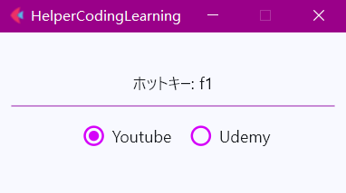

#### コーディング中hot_keyを押せば目標サイトの動画が自動で止めまたは再開することができる簡単なアプリです。

これでスムーズにコーディングすることができて、コーディング効率が圧倒的に向上します。

#### 現在のhot_keyはF1です
#### config.jsonの中で自由で色んな設定を調整できます
```
pyinstaller main.py --noconsole --icon=favicon.ico
```
