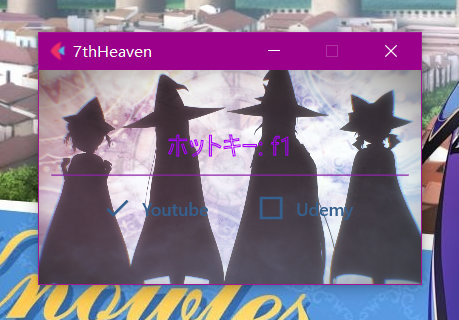

#### コーディング中hot_keyを押せば目標サイトの動画の再生をコントロールすることができる簡単なアプリです。

これでスムーズにコーディングすることができて、コーディング効率が圧倒的に向上します。

#### 現在のhot_keyはF1です
#### config.jsonの中で自由で色んな設定を調整できます
- delayは画面切り替えの遅延です、デフォルトは0.6(0.6秒の意味)、アプリがちゃんと機能しない場合はこのdelayの数値を調整してみてください。

#### exe化
```
pyinstaller main.py --noconsole --icon=favicon.ico
```

